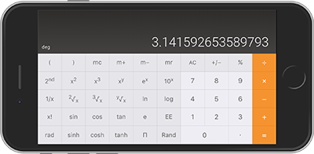

Calculator
=====================
A calculator app built with React. The functionality and design are based on Apple's calculator app.

- Includes basic and scientific modes
- Can be installed as a mobile app (Android/windows only)
- On mobile, the calculator mode is set based on device orientation... rotating device to landscape switches to scientific mode, portrait for basic mode.

#### Scientific Keys
| Key  | description |
|:-----|:-----------------|
| X2  | square the displayed value |
| X3  | cube the displayed   value |
| Xy  | Raise the displayed value to the power of the next value entered |
| 1/x   | Calculates the inverse of the displayed value |
| 2&radic;x | calculate the square root of the displayed value |
| 3&radic;x  | Calculate the cube root of the displayed value |
| y&radic;x  | Calculate the nth root of the displayed value where n is the next value entered |
| ln  | Calculate the natural logarithm of the displayed value |
| log10  | Calculate the base 10 logarithm of the displayed value |
| x!  | Calculate the factorial of the displayed value |
| sin  | Calculate the sine of the displayed value |
| cos   | Calculate the cosine of the displayed value |
| tan  | Calculate the tangent of the displayed value |
| sinh  | Calculate the hyperbolic sine of the displayed value |
| cosh  | Calculate the hyperbolic cosine of the displayed value |
| tanh  | Calculate the hyperbolic tangent of the displayed value |
| e  | Set display value to Euler's number |
| &Pi; | Set display value to PI |

#### Functions Keys
| Key  | description |
|:-----|:-----------------|
| ( | Open parenthesis (not yet) |
| ) | Close parenthesis (not yet) |
| mc | Clear the memory |
| m+ | Add the displayed value to memory |
| m- | Subtract the displayed value from memory. |
| mr | Recall the value stored in memory and displays it |
| rad | Set the unit of measurement for angles to radians |
| deg | Set the unit of measurement for angles to degrees |

#### Basic keys
| Key  | description |
|:-----|:-----------------|
| +/- | Negate the displayed value |
| % | Convert displayed value to a percentage |
| / | Divide displayed value by the next value entered |
| + | Add the next value entered to the displayed  value |
| - | Subtract  the next value entered from the displayed value |
| x | Multiply displayed value by next value entered |

### Live Demo:
https://lukepeavey.github.io/calculator/
